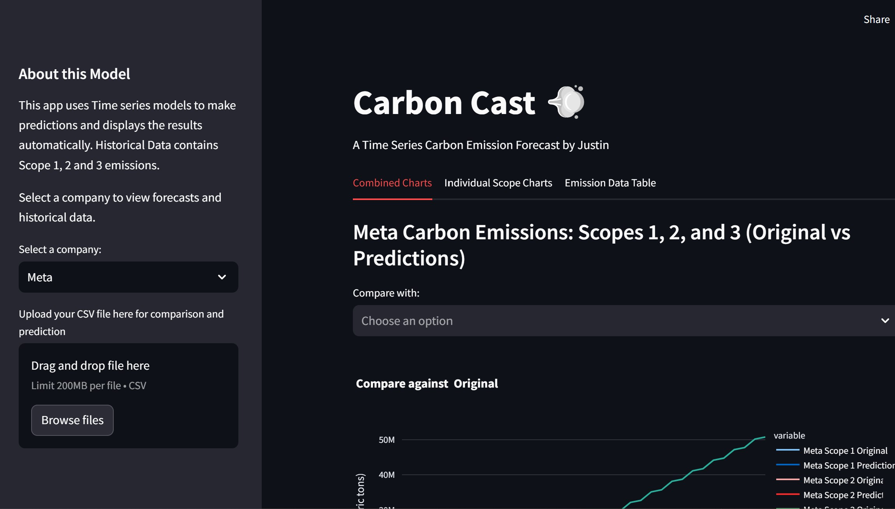

# Carbon Cast - A Carbon Emission Predictor 💨 

## Introduction 
By Justin:

This project uses 6 years of historical data from (Scope 1, Scope 2 and Scope 3) to predict forecast values of carbon emission to 2050. The data is extracted from Meta, Fujitsu, Amazon, Google and Google sustainability report. It is targeted to users, company or anyone who has interest in looking at the forecasted values of carbon emission using of Scope 1, 2 and 3. It also allow users to upload their csv data file of historical data to predict (with one of my trained model) the forecasted values up to 2050.

 

## About this Data

This projects uses Scope 1, 2 and 3 carbon missions downloaded from the sustainability reports from the respective companies (Meta, Google, Amazon, Fujitsu, Microsoft). 

 

## Streamlit Demo

<h3>Demo is can be found over <a href = "https://carbon-cast.streamlit.app/">here</a></h3>
</img>

## Conclusion

This project successfully delivers a user-friendly streamlit application for forecasting data up to 2050 which is the main goal for many companies and countries around the world. They are also able to input their data, users can gain valuable insights into potential future trends and values. The application offers flexibility by allowing users to upload their own CSV files for customized analysis. Additionally, the ability to download forecasted results empowers users to conduct further exploration and integrate the data into their workflows.

